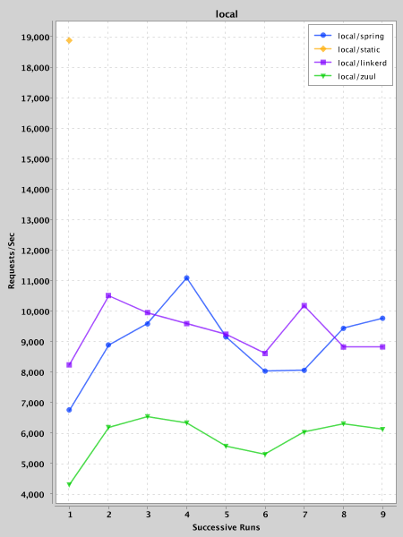
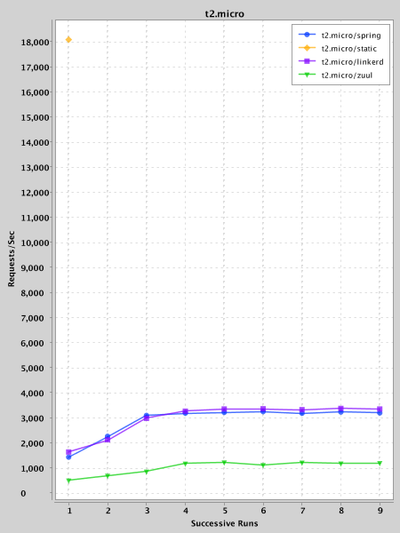
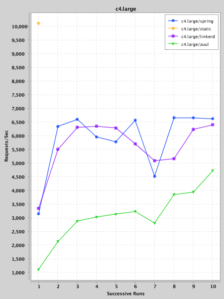
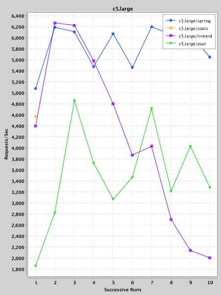
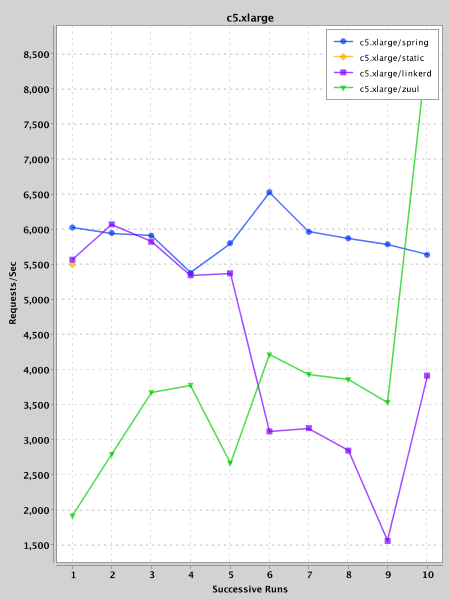
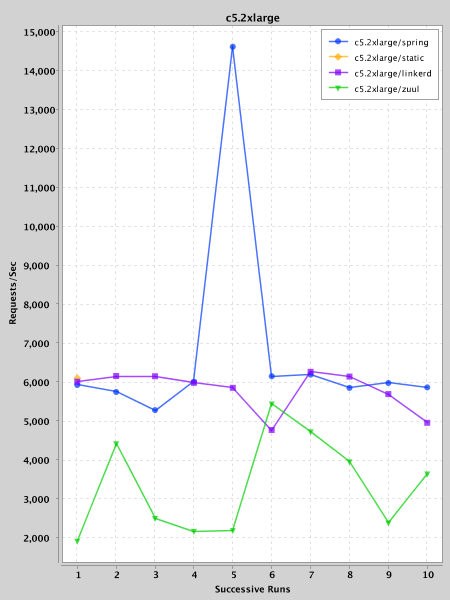
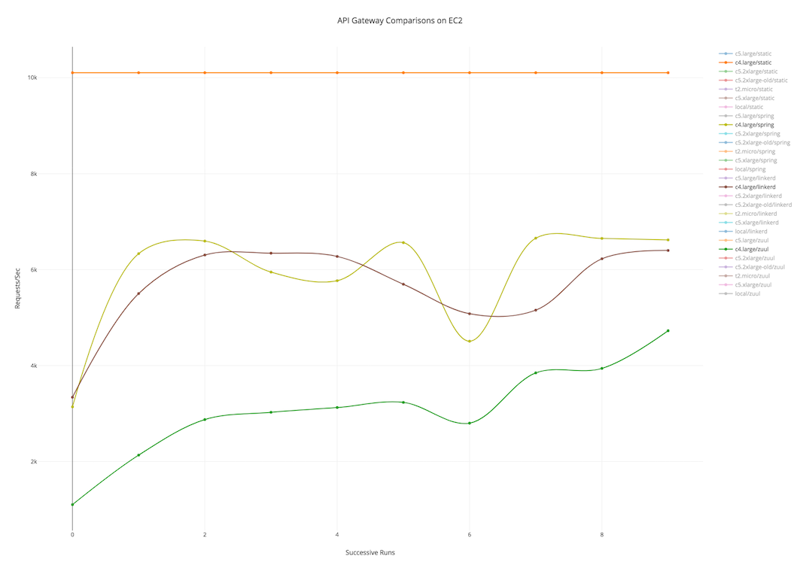

Spring Cloud Gateway Benchmark
==============================

This is a benchmark code to compare the following API gateways:

1. **spring**: Spring Cloud Gateway, 2.0.0.BUILD-SNAPSHOT
2. **zuul**: Netflix Zuul, 1.3.1
3. **linkerd**: Linkerd, 1.3.4

This repo forked from the [Spencer Gibb's repo](https://github.com/spencergibb/spring-cloud-gateway-bench)
to make running on EC2 easier.


# How to use

## Local-machine usage

1. Checkout this repo.
2. Ensure JDK8, Maven, ack and wrk installed.
   If you have `yum` installed, you can use `./prepare-environment.sh` script.
3. Run `./run.sh sgc` to run server, gateways and clients in the local machine.
4. Wait to see `Script Finished` message in _gateway_ machine's console.
5. Inspect reports saved under `./reports/local` directory.


## Amazon EC2 usage

1.  Create 3 EC2 instances with Amazon Linux image: server, gateway, client.
2.  Ensure machine can send http requests to each other.
    Add corresponding rules to their security groups if needed.
3.  Checkout this repo in each machine.
    ```
    sudo yum -y install git ; \
    git clone https://github.com/mmdemirbas/spring-cloud-gateway-bench.git ; \
    cd spring-cloud-gateway-bench
    ```
4.  Run `./prepare-environment.sh` to ensure JDK8, Maven, ack and wrk installed in each machine.
5.  Run `./run.sh s` in _server_ machine.
6.  Run `./run.sh g <server-host>` in _gateway_ machine replacing
    `<server-host>` with the actual IP address or hostname of the _server_ machine.
7.  Wait to see `Script Finished` message in _gateway_ machine's console.
8.  Run `./run.sh c <server-host> <gateway-host>` in _client_ machine replacing
    `<server-host>` with the actual IP address or hostname of the _server_ machine and
    `<gateway-host>` with the actual IP address or hostname of the _gateway_ machine.
9.  Wait to see `Script Finished` message in _client_ machine's console.
10. Inspect reports saved under `./reports/local` directory.
    See _Inspecting Results_ section for details.
11. When you finished with a machine, you can run `./run.sh show`
    to see background processes and `./run.sh kill` to kill them.
    The _server_ & _gateway_ machines run background processes, but the _client_ is not.


## Other usages

System can be run using `./run.sh` in different ways. For example, you can
run server and gateways in the same machine while keeping the clients in a
different machine.

Run the `./run.sh` without any parameter to see sample usages:

```
usage:

        ./run.sh command args...

examples:

        ./run.sh show                                # show running instances of server, gateways & clients
        ./run.sh kill                                # kill running instances of server, gateways & clients

        ./run.sh sgc                                 # run server, gateways & clients

        ./run.sh sg                                  # run server & gateways
        ./run.sh c   <server&gateway-host>           # run clients (assuming both gateways and server running at the specified host)

        ./run.sh s                                   # run server
        ./run.sh g   <server-host>                   # run gateways (assuming the server running at the specified host)
        ./run.sh c   <server-host> <gateway-host>    # run clients (assuming the server and gateways runnning at the specified hosts accordingly)
```


# Inspecting Results

Results saved subdirectories under `reports` directory:

```
static.txt      # report for direct access (without using any API gateway)

spring.txt      # report for Spring Cloud Gateway 2
linkerd.txt     # report for Linkerd
zuul.txt        # report for Zuul
```

A sample report content shown below:
```
Running 30s test @ http://172.31.36.74:8082/hello.txt
  10 threads and 200 connections
  Thread Stats   Avg      Stdev     Max   +/- Stdev
    Latency    65.37ms   38.03ms 843.73ms   85.15%
    Req/Sec   318.10     73.10   828.00     82.31%
  94690 requests in 30.04s, 13.37MB read
  Non-2xx or 3xx responses: 2
Requests/sec:   3152.01
Transfer/sec:    455.58KB
```


## Downloading reports from EC2

If you are using Amazon EC2, you can download all reports at once with a
SCP command similar to the below one:
```
mkdir reports/remote
scp "ec2-user@ec2-10-20-30-40.us-west-2.compute.amazonaws.com:/home/ec2-user/spring-cloud-gateway-bench/reports/local/*" reports/remote
```

## Extracting insights

Once you have downloaded the reports, you can generate a summary file
to use later for plotting with the following command:

```
cd reports/remote
ack "Requests/sec:" -H --nogroup | cut -d":" -f1,4 | sed 's/.txt: */,/g' >> summary-list.csv
```


## Plotting a chart

`Plot.kt` under `inspect` module can be used to quickly plot line charts from your data.
You may need to edit code to specify input file location, output mode etc.
After running the `main` method, the chart(s) either shown on the screen
or saved to the `reports/charts` directory depending on the selected
output mode. Below charts generated from real data in this way:














You can also use [Plot.ly](https://plot.ly/create/) online service to create plots.
To plot your data, you need to transform `summary-list.csv` into `summary-table.csv`
and upload to Plot.ly website.
`SummaryListToTable.kt` under `inspect` module can be used for this conversion.

A sample Plot.ly chart shown below (click to go to the interactive Plot.ly chart):

[](https://plot.ly/~mmdemirbas/6/)

# Troubleshooting

`run.sh` script tries to hide most of the unrelated output from the user.
If you need to inspect output for some reason, you can find them under `logs` directory.
Different log files created where each one named after the corresponding component:

```bash
```bash
spring.log            # spring maven output
spring-build.log      # spring runtime output
linkerd.log           # linkerd runtime output
webserver.log         # webserver runtime output
zuul.log              # zuul runtime output
zuul-build.log        # zuul maven output
```
